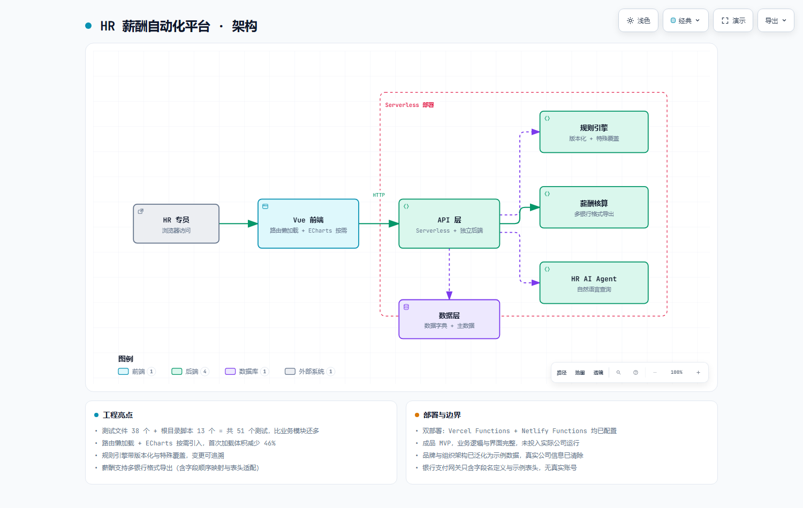

# hr-payroll-platform · 一体化薪酬与人力资源管理平台

企业级 HR 平台：**数据字典驱动的规则即数据架构** + 前后端分离 + 5 分钟可跑的本地部署。



> 可缩放交互版：[`docs/architecture.html`](docs/architecture.html)

---

## 项目定位

这不是一个「能算工资」的工具，而是一套**把企业薪酬规则从代码里抽出来、变成可配置数据**的架构。

传统做法：调整薪级需要改代码、测试、发版。
本项目的做法：薪级、津贴、社保系数、豁免策略都是**数据字典里的行**，改配置即时生效，历史版本可追溯。

**适用**：中小型企业自建 HR 系统、外包实施项目交付、以及想理解 HR 系统应该如何正确建模的开发者。

**本仓库已做合规清理**：代码中的真实姓名、公司名、品牌标识均已替换为示例占位，可直接用于学习或二次开发。

---

## 一句话架构

```
前端 (Vue 3, browser-only)
        │ HTTP JSON（纯静态托管，无 Node 依赖）
        ▼
后端 (backend_server.js, 单文件 HTTP 服务)
        │
        ├─── rules 引擎  ←── 数据字典（规则即数据，不写代码）
        │        ↓
        │     薪级 / 福利 / 豁免 / 审批 四套配置
        │
        ├─── finance 引擎：工资计算 + 银行代发
        └─── 前端 + 后端共享的同一份数据字典（前后端一致）
```

**核心设计决策**：前端是 **browser-only** 的——不经过 npm build，直接用 `file://` 或任何静态托管就能跑。后端是一个单文件 Node HTTP 服务，无 Express、无框架。**零构建工具**是这个项目刻意选择的约束，让企业客户的技术同事能 5 分钟内部署起来。

---

## 快速开始

```bash
# 1. 启动后端（默认 3000 端口）
node backend_server.js

# 2. 打开前端（任意静态服务器或直接打开）
npx serve src
# 或者直接双击 src/index.html（前端不依赖构建）
```

**没有需要配置的密钥、数据库或环境变量**——这是刻意的。所有数据都在内存中，刷新即重置，便于演示与测试。

---

## 核心设计：规则即数据

这是项目最有价值的部分。

### 传统做法（❌）

```javascript
// 薪级写死在代码里
if (level === 'A1') baseSalary = 8000;
else if (level === 'A2') baseSalary = 9000;
else if (level === 'A3') baseSalary = 11000;
// ...每次调整薪级都要改代码、测试、发版
```

### 本项目的做法（✅）

```javascript
// 薪级是数据字典里的一行
data_dictionary.js:
{ key: 'sal_grade', value: {
    A1: { label: '初级', base: 8000, bonusMax: 2000 },
    A2: { label: '中级', base: 9500, bonusMax: 4000 },
    A3: { label: '高级', base: 12000, bonusMax: 8000 }
} }
```

调薪级 → 改数据 → 前后端**共享同一份字典**，无需改代码。

### 为什么「共享同一份字典」是关键

前端做 UI 校验（下拉框选项、字段提示），后端做业务计算。如果两处各写一份，改一处忘另一处就是隐性 bug。本项目的做法是 `src/common/data_dictionary.js` 被前后端**同时 import**——一处定义，处处生效。

`brand_config.js`（品牌配置）同理：颜色、Logo、组织名称集中管理，改一处 UI 全站生效。

---

## 规则引擎的三层结构

项目实现了三层规则，覆盖 HR 常见场景：

| 层 | 模块 | 用途 |
|---|---|---|
| **基础规则** | `special_rule_engine.js` | 薪酬项、科目、基础计算规则 |
| **特殊覆盖** | `special_rule_override_engine.js` | 针对特定人员/岗位的规则覆盖（例如某岗位不参与绩效系数） |
| **例外豁免** | `special_exception_rule.js` | 单人级别的豁免（如试用期员工不发放年终奖） |

**版本管理**：规则配置有版本号（`tr-1.7.2-rule-versioning.test.js` 验证），修改不覆盖历史，可追溯。这在审计场景下非常重要——「上个月为什么张三拿了这个数」要能查到当时生效的是哪一版规则。

### 薪酬计算引擎

`salary_calculation_engine.js` 实现了完整的计算流程，含 **7 大模块**：

1. 数据加载（人员、薪级、岗位、绩效）
2. 基础工资计算（基本工资 + 岗位工资 + 绩效系数）
3. 各类津贴叠加（交通、餐补、住房、通讯）
4. 社保公积金扣除（基数、比例、上下限）
5. 个人所得税（累计预扣法）
6. 特殊规则应用（override + exception 层）
7. 结果输出与校验（应发、应扣、实发、明细）

### 银行代发网关

`bank_payment_gateway.js` 对接银行代发工资的**文件生成与校验**——不是真的走银行接口（那需要企业 CA 与专线），而是生成符合银行规范的支付文件 + 提供校验工具，让财务人员能人工对账。

**这是刻意的设计边界**：接入真实银行接口属于合规敏感操作，本项目不触碰。

---

## 前后端一致性

`master_data_api.js` 同时被前端和后端引用，保证：

- 字段定义一致（下拉选项、字段校验）
- 枚举值一致（岗位、部门、职级）
- 计算参数一致（社保系数、税率表）

**收益**：不会出现「前端显示 8000 元、后端算出来 8500 元」这类前后端不一致 bug。

---

## 测试体系

项目自带**三层测试**，共 50+ 测试文件：

### 1. 后端单元测试

位于 `src/tests/`，覆盖规则引擎、薪酬计算、数据一致性等核心逻辑。运行：

```bash
# 使用内置测试运行器（零依赖）
node src/tests/run-all-tests.js
```

### 2. 端到端测试

`src/tests/e2e-automation-test.js` 模拟完整流程：创建人员 → 配置薪级 → 计算工资 → 生成代发文件。验证端到端可跑通。

### 3. 专项回归测试（根目录）

针对特定需求变更的回归测试，例如：

- `test_TR_6_3_and_6_4.js` — 培训系统 6.3 与 6.4 版本回归
- `test_task21.js` ~ `test_task33.js` — 客户需求的独立验证

**这份测试清单本身就是交付质量的证据**：每个功能点都有对应测试，改一处不担心影响别处。

---

## 项目结构

```
hr-payroll-platform/
├── backend_server.js          # 单文件 HTTP 后端（零框架）
├── src/
│   ├── index.html             # 前端入口（browser-only，无构建）
│   ├── api/                   # 前后端共享的 API 接口定义
│   ├── modules/               # 业务模块（按功能拆分）
│   │   ├── rules/             # 三层规则引擎
│   │   ├── finance/           # 薪酬计算 + 银行代发
│   │   ├── training/          # 培训管理系统
│   │   ├── dashboard/         # 管理驾驶舱
│   │   ├── attendance/        # 考勤处理
│   │   └── rag/               # AI 知识接入
│   ├── launch/                # 培训操作手册、培训数据
│   ├── tests/                 # 单元测试 + E2E
│   ├── common/                # 共享的字典与配置（前后端复用）
│   ├── components/            # 通用 UI 组件
│   └── router/                # 路由配置
├── test_*.js                  # 专项回归测试（13 个）
├── docs/                      # 架构文档
├── exports/                   # 脱敏示例数据（无真实姓名）
├── netlify.toml               # Netlify 部署配置
└── package.json
```

---

## 技术选型与理由

| 选择 | 理由 |
|---|---|
| **前端 browser-only** | 无构建步骤，`file://` 直接可跑，企业 IT 部署门槛低 |
| **后端零框架** | 单文件 Node HTTP，客户运维不需要装 npm 依赖 |
| **前后端共享数据字典** | 从架构层消除前后端不一致 bug |
| **规则即数据** | 调薪级/津贴不需要改代码、发版 |
| **测试文件 50+** | 覆盖核心逻辑 + 每个需求点回归 |
| **不接入真实银行/税务** | 合规边界明确，只做文件生成与校验 |

---

## 已知边界（诚实说明）

- **无持久化**：内存存储，重启即丢。生产环境需接数据库
- **无鉴权**：本仓库面向演示与学习，不含用户认证。生产需自行加
- **不接真实外部系统**：银行、税务、社保都是模拟。真实接入涉及合规与专线
- **多租户未实现**：单公司单租户设计
- **UI 走的是"能看清、能操作"的实用风格**，非设计竞赛级别

**这些边界不是缺陷，是刻意的取舍**——本项目目标是让客户能在 5 分钟内跑起来并理解系统，而不是提供一个生产就绪的黑盒。

---

## 合规声明

本仓库已做以下清理，可直接用于学习、教学与二次开发：

- ✅ **真实姓名替换**：所有代码中的真实姓名已替换为通用占位（如"审批人"、"HR管理员"）
- ✅ **公司名替换**：品牌名、公司名、官网已泛化为"示例集团"
- ✅ **敏感文件排除**：`_wechat_analysis.txt`（微信会话深度分析）、`.vercel/`、`.trae/` 已排除
- ✅ **exports/ 保留**：仅含 `EMP-EXE-008` 这类脱敏 ID，无真实姓名金额

**如果你基于本仓库开发真实业务系统**：请自行实现鉴权、数据加密、审计日志，并遵守所在行业的数据合规要求。

---

## 许可证

MIT License — 见 `LICENSE`
